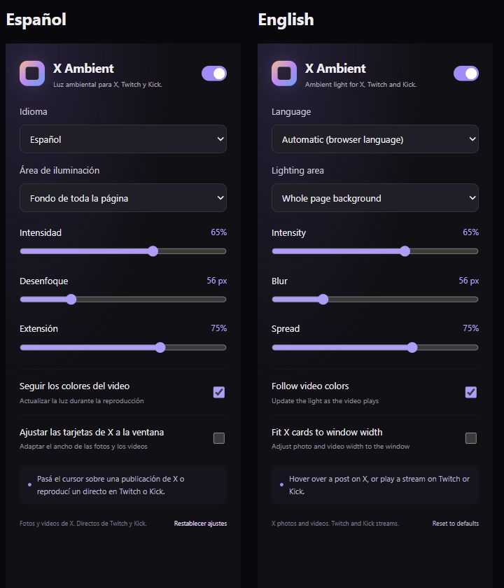

# X Ambient

Luz ambiental para fotos y videos de X e Instagram y directos de Twitch y Kick. En X, el detalle de una publicación se ilumina automáticamente; en la cronología y las respuestas, pasá el cursor sobre una publicación. En Instagram, la iluminación sigue la publicación o el Reel activo sin pasar el cursor. En Twitch y Kick, la iluminación sigue automáticamente el video visible más grande.

[English](README.md) · Español · [日本語](README.ja.md)

## Funciones

- Iluminación en el fondo de toda la página o alrededor de la publicación o el reproductor.
- Iluminación automática de la publicación abierta en su detalle. Las respuestas cambian la luz al pasar el cursor; al salir de una respuesta, vuelve a la publicación abierta. Se excluye el contenido fuera de la ventana.
- En el feed y Reels de Instagram, se selecciona la publicación centrada; los videos en reproducción tienen prioridad cuando están mayormente visibles. Los carruseles usan solo la imagen visible.
- Colores que se proyectan desde los bordes del contenido, sin desenfocar las fotos ni los videos originales.
- Actualización de los colores del video hasta 12 veces por segundo, con soporte para pausas y desplazamientos.
- Compatibilidad con temas claros y oscuros y con la preferencia de movimiento reducido.
- Intensidad, desenfoque y extensión ajustables.
- Ajuste opcional del ancho de las tarjetas de X, desactivado de forma predeterminada.
- Español, inglés, japonés, coreano, chino simplificado y tradicional, tailandés, vietnamita, indonesio, francés, alemán, portugués de Brasil y Portugal, italiano, ruso, árabe e hindi. El idioma se detecta automáticamente según Chrome y también se puede elegir desde la extensión.

## Instalar en Chrome

1. Extraé el ZIP de esta versión, o descargá y extraé el código de este repositorio.
2. Abrí `chrome://extensions` y activá **Modo desarrollador**.
3. Elegí **Cargar descomprimida** y seleccioná la carpeta que contiene `manifest.json`.
4. Recargá X, Instagram, Twitch o Kick. Abrí el detalle de una publicación de X o pasá el cursor sobre publicaciones y respuestas, navegá por el feed o Reels de Instagram sin pasar el cursor, o abrí un video o un directo en Twitch o Kick.

No necesitás Node.js ni instalar dependencias para usar la extensión. Para actualizarla, reemplazá los archivos en la misma carpeta, pulsá **Recargar** en la extensión y recargá las páginas abiertas.

## Ajustes

Abrí el icono de la extensión en la barra de herramientas. Los cambios se guardan en tu dispositivo y se aplican a las pestañas compatibles.

| Ajuste | Valor inicial |
| --- | --- |
| Luz ambiental | Activada |
| Área de iluminación | Fondo de toda la página |
| Intensidad | 65 % |
| Desenfoque | 56 px |
| Extensión | 75 % |
| Seguir los colores del video | Activado |
| Ajustar las tarjetas de X a la ventana | Desactivado |
| Idioma | Automático, según Chrome |

En **Idioma**, podés elegir cualquier idioma compatible por su nombre nativo. El chino se detecta según la escritura y la región del navegador; la selección manual tiene prioridad. El portugués distingue Brasil y Portugal; si no se indica una región, usa la traducción de Brasil. El árabe se muestra de derecha a izquierda. Los idiomas del navegador que no estén disponibles usan el inglés. **Restablecer ajustes** restaura la iluminación y conserva tu elección de idioma.



## Probar y compilar

Para desarrollar, usá Node.js 22 o una versión posterior. No hay dependencias de npm.

```sh
npm run check
npm test
npm run demo
```

Abrí `http://127.0.0.1:4318`. La demo usa el mismo motor que la extensión e incluye fotos y videos locales. Podés probar los dos temas, cambiar el idioma y agregar publicaciones nuevas. Las páginas `tests/fixtures/stream.html?site=twitch` y `?site=kick` permiten comprobar los reproductores con videos locales. Estas pruebas no sustituyen la verificación de la extensión instalada en los sitios reales.

Para crear el ZIP instalable:

```sh
npm run package
```

Se generan `output/x-ambient/` y `output/x-ambient.zip`. El empaquetado funciona en Windows, macOS y Linux usando solo los módulos estándar de Node.js. La variable `X_AMBIENT_OUTPUT_DIR` permite elegir otra carpeta de salida.

## Privacidad y límites

La extensión solicita únicamente `storage` y se ejecuta en X/Twitter, Instagram, Twitch y Kick. Los ajustes y las traducciones se guardan y cargan localmente. No captura la pantalla, no envía datos a servicios externos y no abre un segundo reproductor.

El motor dibuja el contenido en lienzos pequeños sin leer ni exportar sus píxeles. El efecto se pausa cuando la página está oculta o el video está en pantalla completa. Los controles del reproductor y el chat siguen siendo interactivos. Los videos protegidos que no permiten dibujarse en un lienzo y los reproductores dentro de marcos de otro origen quedan fuera del alcance actual. Instagram admite publicaciones del feed y Reels; las historias, los mensajes y las cuadrículas de perfiles quedan fuera del alcance actual. Los cambios de estructura de los sitios pueden requerir actualizaciones.

## Licencia

[MIT](LICENSE). El proyecto original, sus imágenes, videos e iconos son de mmnga. Este proyecto no está afiliado a X/Twitter, Instagram, Twitch ni Kick.
